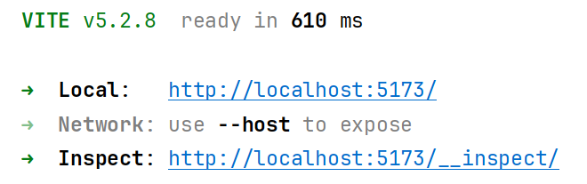
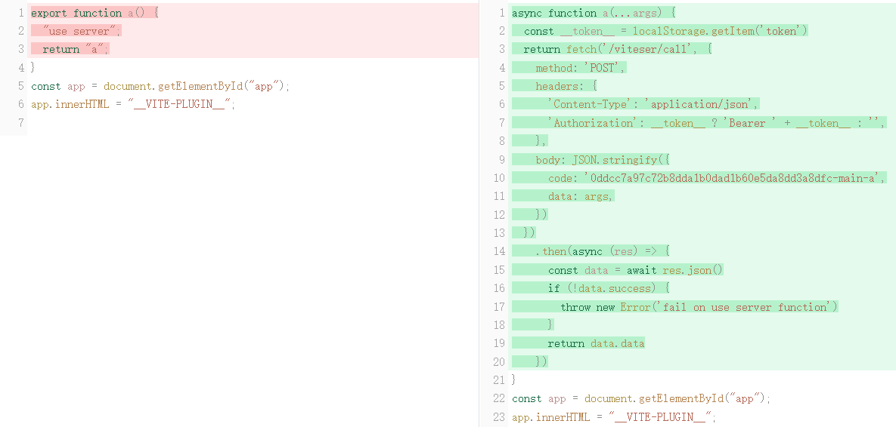

### 介绍

[viteser](https://github.com/sia-fl/viteser) 是一个 vite 插件，他允许你在 vite 项目中直接将被调用的函数转换成 api。

```typescript jsx
// src/api.ts
import { db } from './db'

export const getUser = async (id: number) => {
  "use server"
  return db.query(`SELECT * FROM users WHERE id = ${id}`)
}

// src/App.tsx
import { getUser } from './api'
import { useState, useEffect } from 'react'

const App = () => {
  const [user, setUser] = useState<{
    id: number
    name: string
  }>({ id: 0, name: '' })
  useEffect(() => {
    getUser(1).then(setUser)
  }, [])
  return <div>{user.name}</div>
}
```

其中的重点在于 "use server"， viteser 会将这个注释识别为一个 api。

### 实现原理

#### 章节 1 前端代码替换

1. 拉取 `viteser` 代码

```bash
git clone https://github.com/sia-fl/viteser.git
pnpm i
```

2. 在 `viteser` 项目中有一个用例，在目录 `/playground` 下，可以直接运行。

```bash
cd playground
pnpm dev
```

3. 在运行完成后我们会看到对应的连接提示，我们打开 `http://localhost:5173/__inspect/`。



通过 `vite-plugin-inspect` 插件，我们可以观测到 `viteser` 是如何变动代码的。



可以看到，`viteser` 会将标记了 `use server` 的函数转换成一个 http 调用。我们这个时候产生了一个实现目标，是在服务端运行这个函数。


